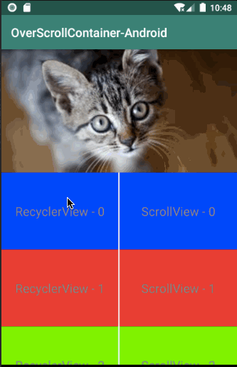

Demo
--------


Download
--------
Use Gradle:

```gradle
dependencies {
    // OverScrollContainer
    implementation 'com.github.ZekunWang:OverScrollContainer-Android:0.1.0'
}
```
How do I use?
-------------------
Configure OverScrollContainer image view in layout xml file (provide cusom params or leave them as default):
```xml
    <com.zwapps.overscrollcontainer.OverScrollContainer
        android:id="@+id/recyclerview_container"
        android:layout_width="0dp"
        android:layout_height="0dp"
        app:layout_constraintTop_toBottomOf="@id/image"
        app:layout_constraintBottom_toBottomOf="parent"
        app:layout_constraintStart_toStartOf="parent"
        app:layout_constraintEnd_toStartOf="@id/scrollview_container"
        app:layout_constraintHorizontal_chainStyle="spread"
        android:layout_marginEnd="1dp"
        app:frictionRate="0.25"
        app:bounceAccelerator="0.1"
        app:slowDownDecelerator="0.3"
        />
```

Or configure zoomable image view in code:
```kotlin
        recyclerViewContainer.frictionRate = 0.25F
        recyclerViewContainer.bounceAccelerator = 0.1F
        recyclerViewContainer.slowDownDecelerator = 0.3F

        recyclerViewContainer.overScrollListener = {
            if (originalHeight == -1F) {
                originalHeight = imageView.measuredHeight.toFloat()
                imageView.pivotY = 0F
            }

            imageView.scaleY = (originalHeight + recyclerViewContainer.child.translationY) / originalHeight
            imageView.scaleX = imageView.scaleY
        }
```
## License

    Copyright [2016] [Zekun Wang]

    Licensed under the Apache License, Version 2.0 (the "License");
    you may not use this file except in compliance with the License.
    You may obtain a copy of the License at

        http://www.apache.org/licenses/LICENSE-2.0

    Unless required by applicable law or agreed to in writing, software
    distributed under the License is distributed on an "AS IS" BASIS,
    WITHOUT WARRANTIES OR CONDITIONS OF ANY KIND, either express or implied.
    See the License for the specific language governing permissions and
    limitations under the License.
